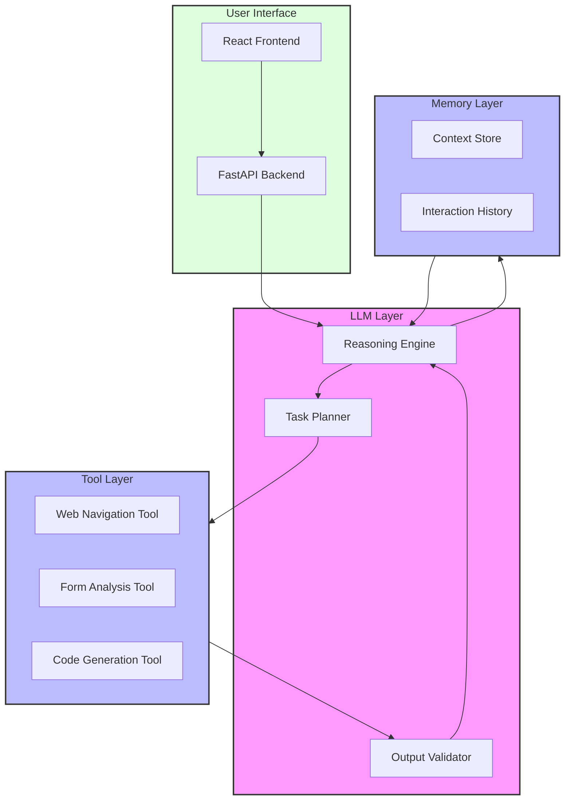

# ART Code Generation System

An LLM-powered system for automating the migration of legacy ASP.NET WebForms to modern REST APIs and HTML forms.

## System Architecture



## Features

- **LLM-Powered Analysis**: Uses advanced language models to analyze form structure and requirements
- **Intelligent Planning**: Automatically plans migration steps and tool execution
- **Automated Form Analysis**: Extracts form elements, validation rules, and event handlers
- **Code Generation**: Generates modern REST APIs and HTML forms
- **Validation**: Ensures generated code meets requirements and best practices
- **Context Management**: Maintains conversation context and history
- **Error Recovery**: Intelligent error handling and recovery strategies

## Technology Stack

### LLM Integration
- OpenAI GPT-4 or similar LLM
- LangChain for LLM orchestration
- Prompt engineering framework
- Context management system

### Backend
- Python 3.9+
- FastAPI
- Playwright
- Jinja2
- pytest

### Frontend
- React 18+
- TypeScript
- Material-UI
- Axios

### Infrastructure
- Docker/Podman
- GitHub Actions
- Prometheus/Grafana

## Quick Start

1. Clone the repository:
```bash
git clone https://github.com/yourusername/art-code-gen.git
cd art-code-gen
```

2. Install dependencies:
```bash
# Install production dependencies
pip install -r requirements.txt

# Install development dependencies (optional)
pip install -r requirements-dev.txt
```

3. Set up environment variables:
```bash
cp .env.example .env
# Edit .env with your configuration
```

4. Start the development server:
```bash
uvicorn src.main:app --reload
```

## User Interfaces

The system provides two ways to interact with it:

### 1. Web Interface
A React-based web interface for general users. See the [UI Documentation](docs/ui.md) for details.

### 2. GitHub Copilot Interface
For developers, the system can be used directly through GitHub Copilot in VS Code. This allows you to:
- Generate code through natural language prompts
- Analyze forms and generate modern implementations
- Create APIs and frontends with specific requirements
- Handle complex form migrations step by step

See the [Copilot Interface Guide](docs/copilot_interface.md) for detailed usage instructions and examples.

## Project Structure
```
art-code-gen/
├── src/
│   ├── llm/           # LLM integration and interfaces
│   ├── tools/         # Specialized tools for form analysis and code generation
│   ├── config/        # Configuration management
│   └── main.py        # Application entry point
├── ui/                # React frontend
├── tests/             # Test suite
├── docs/              # Documentation
├── templates/         # Code generation templates
├── requirements.txt   # Production dependencies
├── requirements-dev.txt # Development dependencies
├── Containerfile      # Container definition
├── pytest.ini        # Pytest configuration
└── run_tests.py      # Test runner script
```

## Container Deployment

The system can be deployed using either Docker or Podman:

- [Docker Deployment Guide](docs/containers/docker.md)
- [Podman Deployment Guide](docs/containers/podman.md)

## Development

### Running Tests
```bash
pytest
```

### Code Style
```bash
black .
isort .
flake8
mypy .
```

## Contributing

1. Fork the repository
2. Create a feature branch
3. Commit your changes
4. Push to the branch
5. Create a Pull Request

## License

This project is licensed under the MIT License - see the [LICENSE](LICENSE) file for details.

## Acknowledgments

- OpenAI for providing the LLM technology
- The FastAPI and React communities
- All contributors to the project